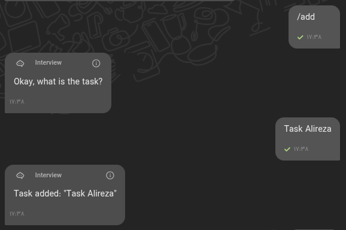
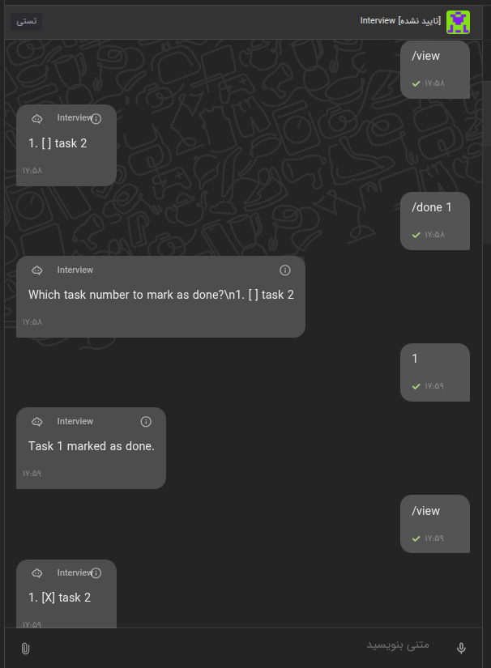

# Divar Kenar To-Do List Chatbot

This project is a to-do list chatbot designed to integrate with Kenar Divar's experimental chatbot feature. It was developed as part of the 4th stage of the Divar interview process.

The chatbot allows users to manage a personal to-do list by sending commands in a chat interface.


## Features

*   **Add Tasks:** Users can add new tasks to their list.
    *   `/add <task description>`: Adds a task directly.
    *   `/add`: Prompts the user to enter the task description.

    Example of adding a task:
    

*   **View Tasks:** Users can view their current list of tasks with their status (done/pending).
    *   `/view`
*   **Mark Tasks as Done:** Users can mark existing tasks as completed.
    *   `/done`: Prompts the user to select a task number to mark as done.
*   **Delete Tasks:** Users can remove tasks from their list.
    *   `/delete`: Prompts the user to select a task number to delete.

    Example of viewing, marking a task as done, and viewing again:
    

*   **Help:** Provides a list of available commands.
    *   `/help`
*   **Conversation State Management:** The chatbot remembers the context of multi-step operations (e.g., waiting for a task number after `/delete`).
*   **JSON-based Data Persistence:** Task lists and conversation states are stored in local JSON files (`tasks.json`, `conversation_states.json`).

## Technology Stack

*   **Python 3**
*   **Flask:** For handling incoming webhooks from the Divar platform.
*   **Requests:** For making API calls.

## Design Principles

The project attempts to follow SOLID principles, particularly:
*   **Single Responsibility Principle (SRP):**
    *   `divar_panel.py`: Handles web requests and basic webhook validation.
    *   `command_handler.py`: Routes incoming messages to the appropriate command logic.
    *   `commands/` (directory): Each command (add, delete, view, etc.) is encapsulated in its own class.
    *   `todo_db.py`: Manages data persistence for tasks and conversation states.
    *   `divar_client.py`: Intended for interactions with the Divar API.
*   **Open-Closed Principle (OCP):**
    *   The `CommandHandler` and the `commands/` structure are designed so that new commands can be added by creating new command classes without modifying the core `CommandHandler` routing logic. Each command inherits from `AbstractCommand`.

## Project Structure

```
.
├── command_handler.py        # Routes messages to specific command classes
├── commands/                 # Directory for individual command logic
│   ├── __init__.py
│   ├── base_command.py       # Abstract base class for all commands
│   ├── add_command.py
│   ├── delete_command.py
│   ├── done_command.py
│   ├── help_command.py
│   └── view_command.py
├── config.py                 # For API keys and configuration
├── conversation_states.json  # Stores active conversation states (created at runtime)
├── divar_client.py           # Client for interacting with Divar APIs
├── divar_panel.py            # Flask app, entry point for webhooks
├── README.md                 # This file
├── requirements.txt          # Python package dependencies
├── tasks.json                # Stores user to-do lists (created at runtime)
└── todo_db.py                # Handles database operations (JSON file interaction)
```

## Setup and Running

1.  **Prerequisites:**
    *   Python 3.x
    *   pip (Python package installer)

2.  **Clone the repository (if applicable):**
    ```bash
    git clone <repository-url>
    cd <repository-name>
    ```

3.  **Install dependencies:**
    Create a virtual environment (recommended):
    ```bash
    python -m venv venv
    source venv/bin/activate
    ```
    Install the required packages:
    ```bash
    pip install -r requirements.txt
    ```

4.  **Configuration (`.env` file):**
    Create a `.env` file in the root directory by copying the `.env_example` file:
    ```bash
    cp .env_example .env
    ```
    Then, edit the `.env` file with your Divar API credentials:
    ```env
    DIVAR_APP_SLUG="your_app_slug"
    DIVAR_API_KEY="your_api_key" # Used by the chatbot for sending messages
    ```

5.  **Run the Flask application:**
    ```bash
    python divar_panel.py
    ```
    The application will start (by default on `http://localhost:8000`).

6.  **Webhook Setup (Ngrok or similar):**
    To receive webhooks from the Divar platform, you'll need to expose your local Flask server to the internet. Tools like [ngrok](https://ngrok.com/) can be used for this.
    ```bash
    ngrok http 8000
    ```
    Ngrok will provide a public URL (e.g., `https://your-unique-id.ngrok-free.app`). This URL (specifically the `/` endpoint) should be configured as the webhook endpoint in the Divar Kenar chatbot settings.

## How it Works

1.  The Divar platform sends a POST request (webhook) to the `/` endpoint of the running Flask application (`divar_panel.py`) when a new message is sent to the chatbot.
2.  `divar_panel.py` receives the request, validates it, and extracts message details.
3.  It passes the message to `CommandHandler`.
4.  `CommandHandler` determines the appropriate command to execute based on the message text (e.g., `/add`) or the current conversation state (e.g., if the bot is waiting for a task number).
5.  The selected command class (from the `commands/` directory) executes its logic, interacting with `todo_db.py` to manage tasks and conversation states.
6.  The command returns a response string.
7.  `CommandHandler` uses `divar_client.send_message_to_conversation()` to send the response back to the user via the Divar API.
